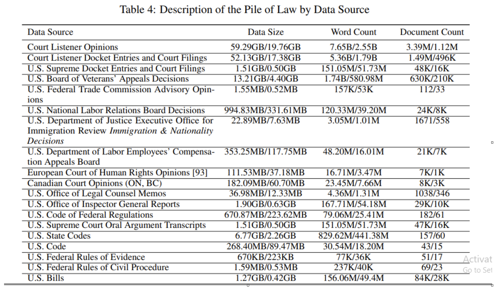

# Evaluation, Finetuning And Refinement

## Objective

The purpose of the finetuning and evaluation process is to prepare the application to perform Question and Answer (Q&A) and Summarization tasks within the legal domain.

## Selection of the model:

An initial study was conducted on various language models to assess their suitability for legal research tasks. The following models were shortlisted for further exploration based on their architecture and legal domain-specific finetuning:

1. **AdaptLLM/law-chat**
   - Finetuned on LLaMA-2-Chat-7B.
   - Quantized versions are available (GGUF, GPTQ).

2. **SaulLM**
   - Finetuned on Mistral-7B.
   - Quantized version available (GGUF).

3. **legalbert-base**
   - Finetuned on BERT and uses a masked language modeling approach.

4. **Legalbert-large**
   - Finetuned on BERT with 1.7M parameters, trained on the "Pile of Law" dataset.
   - May exhibit racial biases.

## Model Features Comparison

| Features | legal-llm | Legalbert-pile of law | saul7b |
|----------|-----------|------------------------|--------|
| Dataset  | FreeLaw Opinions from the Pile (Gao et al., 2021) | Pile of law | FreeLaw, EDGAR, English MultiLegal Pile, English EuroParl, GovInfo7 Statutes, Opinions & Codes, Law Stack Exchange, Commercial Open Australian Legal Corpus, EU Legislation, UK Legislation, Court Transcripts, UPSTO1 |
| Tokens   | 16.7B     | ~30B                   | 94B    |
| Tasks    |           | Masked                 |        |

## Dataset for 'Pile of Law'

The "Pile of Law" dataset includes various data sources, such as:

## Comparison Study

### SaulLM-7B

SaulLM-7B is a large language model (LLM) specifically designed for the legal domain. It has 7 billion parameters and is built on the Mistral-7B architecture. Trained on an English legal corpus of over 30 billion tokens, SaulLM-7B excels in legal document comprehension and generation tasks, demonstrating state-of-the-art capabilities in understanding legal texts.

### AdaptLLM

AdaptLLM is further trained on reading comprehension texts constructed from raw legal corpora mixed with general instructions. This approach allows the model to learn from large-scale domain-specific raw corpora and improves its performance in comprehension tasks, making it more suitable for legal research.

### LegalBERT

LegalBERT models are finetuned on BERT, with two variants, Legalbert-base and Legalbert-large. But this model possesses a potential bias issue.

Based on the application's use cases, AdaptLLM is chosen as it performs better than the other models in legal research tasks.

## Evaluation Process

### LLM Evaluation

To evaluate the performance of the LLM, the similarity between the LLM-generated answers and the ground truth answers was measured. The evaluation employed **BertScore**, with metrics such as **Precision**, **Recall**, and **F1 Score**.

#### Methodology:

1. A dataset of questions and ground truth answers was manually verified for quality.
2. The questions were fed to the LLM to generate corresponding answers.
3. The generated answers were compared to the ground truth using BertScore.

### Evaluating RAG (Retrieval-Augmented Generation) Capabilities

The faithfulness of the LLM-generated answers was assessed by checking whether the generated answers were factually consistent with the context. **HHEM (The Hughes Hallucination Evaluation Model)** from Vectara was used for computing faithfulness.

#### Methodology:

1. A dataset of questions, context, and ground truth answers was prepared and verified.
2. The questions and context were input into the LLM to generate answers.
3. The similarity between the context and the LLM-generated answer was evaluated using HHEM.

## Results:

Results of LLM Evaluation are shown below:

- Sample size: **500**
- Mean Precision: **0.8852**
- Mean Recall: **0.8942**
- Mean F1 Score: **0.8889**

And the following is the Faithfulness evaluation results:

- Sample size: **290**
- HHEM Score: **0.88**
