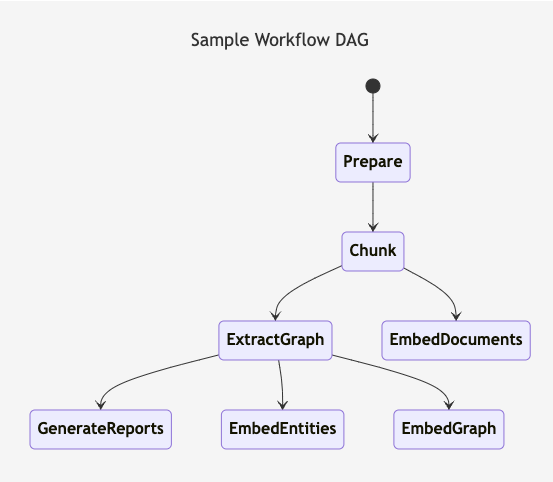

# Graph RAG

Graph RAG constructs a knowledge graph to represent and query structured relationships between legal entities and concepts. This approach excels at capturing and querying the structured aspects of legal cases.

## Key Components:

- Graph Database: Neo4j
- Entity Types: Judges, courts, plaintiffs, defendants, attorneys
- Relationship Types: PRESIDES_OVER, HEARD_IN, REPRESENTS, CITES, etc.

In Graph RAG, legal documents are processed to extract entities and relationships, which are then stored in the Neo4j database. Queries can traverse these relationships to find relevant information, such as all cases heard by a specific judge or all precedents cited in a particular case.

## Strengths:

- Excels at representing and querying structured relationships in legal cases
- Provides clear visibility into the connections between different legal entities

## Limitations:

- May not fully capture the semantic nuances in legal arguments and opinions

